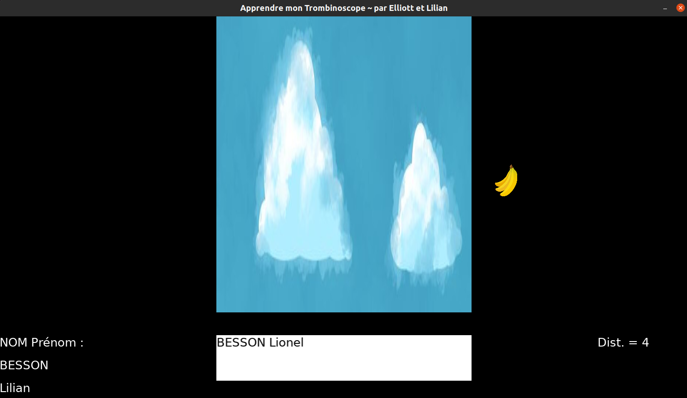

# *Apprendre un Trombinoscope* ~ *par Elliot & Lilian*

Un petit jeu 2D, écrit en Lua avec le framework Löve2D (<https://love2d.org>), dans le but de faciliter l'apprentissage d'un trombinoscope pour un prof en septembre.

Ici, voici un exemple pour apprendre trois noms de participants au CodeClub de la Ludothèque de Briançon, avec de fausses photos de profil :

- Il faut taper dans la boîte au milieu le nom qui s'affiche à gauche de l'écran.

- A droite de l'écran s'affiche la [distance de Levenshtein](https://fr.wikipedia.org/wiki/Distance_de_Levenshtein) entre le nom actuellement tapé et le nom qu'il faut obtenir. A noter que ceci ne prend *pas* en compte la casse (minuscule ou majuscule) mais le reste est pris en compte.

## Comment utiliser ce mini projet ?

1. Télécharger l'archive zip contenant son code source ;
2. Installer Löve2D en suivant le tutoriel en ligne sur <https://love2d.org/> ;
3. Ajoutez toutes les photos de vos élèves (ou de vos ami-e-s, ou Pokémons préférés), nommées correctement selon le format précis "NOM_Prénom.jpg", dans le dossier `img/` qui contient déjà [cette image](img/banana.png) ;
4. Lancer le jeu avec `love .` dans le dossier.
5. Normalement, ce genre d'interface apparaît. Attention le chargement peut prendre du temps avec une cinquantaine de photos, c'est normal.

## À propos de ce mini projet

Ce mini projet nous a permis de progresser en Lua et en Löve2D, dans le cadre des ateliers de programmation que [Lilian Besson](https://GitHub.com/Naereen) anime au printemps 2023 à la Ludothèque et au Fablab de Briançon (voir [cette page](https://github.com/aucoindujeu/codeclub)).

----

## Avancement du mini projet

- [x] Premier prototype correct ;
- [x] Ajout d'un titre, d'un bouton "suivant" (avec une image rigolote) ;
- [x] Ajout de la distance de Levenshtein ;
- [x] Randomisation ? Non, je préfère laisse par ordre alphabétique.
- [x] Ajout d'une documentation et mise en ligne sur GitHub.
- [x] Ajout d'une capture d'écran.

### Idées supplémentaires ?

- [ ] Être plus robuste au format/noms des images ? Pour l'instant, il *faut* que les images soient des .jpg (JPEG) au format "NOM_Prénom.jpg" dans le dossier `img/`.
- [ ] Faire un bel écran de réussite si on termine toute la liste ? Chiant, j'ai la flemme. A la place, je laisse une exception dans le code, ça interrompt le programme.
- [ ] Sauvegarder sur le disque dur (localement) l'indice de la dernière photo à laquelle on est arrivé, pour repartir de là et pas du début ?

----

## License ?

[MIT Licensed](LICENSE)
© [Elliot](https://GitHub.com/Elliott005) & [Lilian Besson (Naereen)](https://GitHub.com/Naereen), mai 2023
